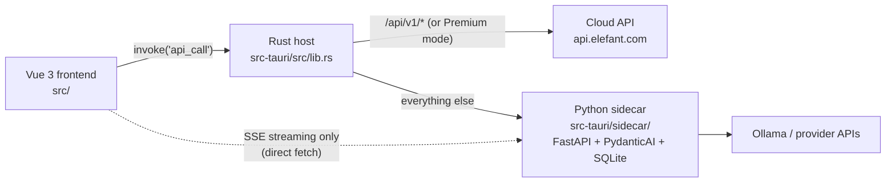

# Rumble — Intern Intro

Welcome. This doc gets you productive in an afternoon. Read it top to bottom, then the "read next" list.

## What this is

**Elefant Rumble** (repo `ivory`) is a desktop app for legal AI work — document review, drafting, research, translation. It's a **Tauri v2** app: a Vue 3 frontend rendered in a webview, a small Rust host process, and a bundled Python FastAPI "sidecar" that runs local AI (Ollama or bring-your-own-key). Since spec 0.4.0 there is also a **cloud tier**: some requests go to `api.elefant.com` instead of the local sidecar.

## Architecture in one diagram



Key ideas:

1. **The frontend never uses `fetch` for API calls** (except SSE, below). Every generated API call goes through the mutator `src/api/client.ts`, which calls the Rust command `api_call` over Tauri IPC.
2. **Rust is a dumb proxy.** `api_call` in `src-tauri/src/lib.rs` picks the target URL (`resolve_url`), attaches a bearer token from the OS keychain, makes the HTTP call with reqwest, and returns the body as an untyped `serde_json::Value`. It deliberately does not model the API in Rust types.
3. **Routing rule** (`BackendMode`: `Ollama` / `Byok` / `Premium`): in Premium mode everything goes to cloud; otherwise paths starting with `/api/v1/` go to cloud and everything else goes to the local sidecar on `127.0.0.1:{port}`.
4. **SSE is the one exception**: streaming responses can't fit through the JSON-in/JSON-out IPC call, so `streamMessage` in `src/api/sidecar.ts` opens a direct `fetch` to the sidecar port.
5. **Sidecar handshake**: Rust spawns the sidecar binary and reads a `PORT:{port}` line from its stdout (printed only after the socket binds) to learn the dynamic port.

## The contract: one spec, two generated clients

`openapi.json` at the repo root is a vendored copy of the backend spec (currently **0.4.0**). It is the source of truth for types. Two codegen pipelines read it:

| Output | Generator | Command | Wire casing |
|---|---|---|---|
| `src/api/generated/` + `src/api/models/` (TS + vue-query composables) | orval (`orval.config.ts`) | `pnpm generate:api` | camelCase (cloud) |
| `src-tauri/sidecar/models/generated.py` (Pydantic v2) | datamodel-codegen (config in sidecar `pyproject.toml`) | `pnpm generate:models` | snake_case (sidecar) |

Rules:

- **Never hand-edit generated files.** CI (`.github/workflows/contract-drift.yml`) regenerates both clients and fails on any diff.
- Refreshing `openapi.json` itself from the backend repo is a manual step.
- **Two clients, two casings**: cloud routes use the orval client (camelCase); local sidecar routes use the hand-written `src/api/sidecar.ts` + `sidecar-types.ts` (snake_case). Don't mix them up.

## Running it locally

Prereqs: Node 20+, pnpm, Rust (pinned to 1.90.0 via `rust-toolchain.toml`), Python 3.12 + uv, Ollama running.

```sh
pnpm install
cd src-tauri/sidecar && uv sync && cd ../..
pnpm dev:sidecar     # terminal 1 — sidecar on :11435
pnpm tauri dev       # terminal 2 — the app
```

## Tests (all must pass before committing)

```sh
pnpm test                                  # Vitest, tests/
pnpm test:e2e                              # Playwright, e2e/
cd src-tauri/sidecar && uv run pytest -q   # sidecar
cd src-tauri && cargo test                 # Rust host
```

CI runs the first, third, and fourth in parallel (`test.yml`), plus the contract-drift gate and a Selenium suite (`webdriver.yml`).

## Read next, in order

1. `src-tauri/src/lib.rs` — the whole Rust host: `api_call`, `resolve_url`, keychain, sidecar spawn, tray. Single most important file.
2. `src/api/client.ts` — the IPC mutator.
3. `src/api/sidecar.ts` — the hand-written sidecar client and SSE path.
4. `src/router.ts` — screens, `/setup` Ollama gate.
5. `src-tauri/sidecar/app.py` + `routes/` + `services/` — sidecar structure (`llm.py` is the PydanticAI agent).
6. `agent_docs/2025-10-01-architecture.md` (big picture, pre-cloud) then `agent_docs/2026-04-03-readiness-session-notes.md` (current reality, hard-won gotchas).

## Gotchas

- **README is stale**: it describes a purely local, on-device app. The cloud tier (`/api/v1/` → `api.elefant.com`) came later and isn't in its diagram.
- **`wiggum.sh`, `wiggum_prompt.md`, `wiggum.log`, `example_wiggum/`** (untracked, repo root) are local Claude Code automation scaffolding — a loop that feeds a task prompt to an autonomous agent. Not part of the app. Same for root `spec.md` / `imp_plan.md` / `2026-04-03-readiness-*.md` — those are inputs to that loop.
- **Auth is stubbed**: `router.ts` hardcodes `isAuthenticated = true`; the sidecar has no auth middleware yet. The cloud bearer token is real (OS keychain via Rust).
- **`src/modules/backend/backendClient.ts` still contains `mock*` functions.** Some views migrated to `sidecar.ts`, some haven't — check which path a view actually uses before assuming.
- **Bundle id is `com.ielegante.rumble`** (not `com.elefant.rumble`) — affects the macOS app-support/DB path.
- **Sidecar binary isn't committed** (`src-tauri/binaries/` is gitignored). Dev uses `pnpm dev:sidecar`; CI `touch`es a stub for cargo builds; releases build it with PyInstaller (`sidecar.spec`).

## Where the project is right now

`main`'s recent history is the "readiness" push: wiring every view (draft, translation, research, review) to the real sidecar, SSE streaming, the `/setup` onboarding page, real keychain-backed provider keys, PyInstaller packaging fixes.

The current branch `chore/contract-refresh-0.4.0` is the cloud-contract refresh: `openapi.json` 0.1.0 → 0.4.0, clean regeneration of both clients (61 orphaned files dropped), snake_case sidecar models, deterministic codegen, the contract-drift CI gate, `/api/v1/` routing fix, Rust 1.90.0 pin, and serde round-trip tests pinning the contract shapes.
