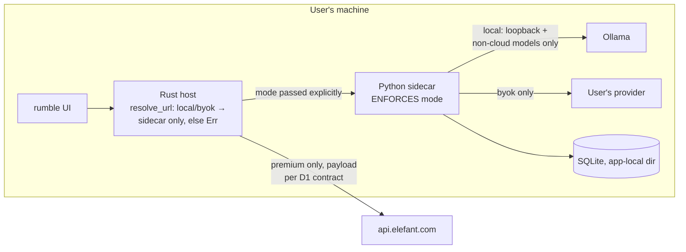

# Credible & Delightful — rumble + word, local-first plan (2026-09-22, v2 post-adversarial)

Owner decision (2026-09-22): local model use is a **compliance requirement** — law firms
carry cybersecurity/data obligations (client confidentiality, matter-level restrictions
on third-party processing, firm infosec review). The local path is the product's spine.

v1 of this plan was attacked by four independent adversarial reviewers (infosec,
feasibility-with-primary-source-verification, funnel coherence, scope). **All four
returned materially-flawed.** v2 integrates every surviving finding; §9 records each
finding and its disposition. Five were block-level and reshape the architecture section.

## 0. Decisions for Ian (everything else proceeds without you)

| # | Decision | Default if you say "go" |
|---|---|---|
| D1 | **Premium payload contract**: premium mode may transmit only user-previewed, explicitly-sent excerpts/questions — never the full document body silently. This contradicts today's `resolve_url` (premium = everything to cloud) and defines the product. | Adopt; premium call sites built to it |
| D2 | **Windows**: under a compliance framing, "cut Windows signing" is incoherent — most firms run Windows. Either buy a signing cert now, or ship "macOS first; Windows build explicitly labeled unsigned preview". | macOS first, honest Windows label |
| D3 | **Apple Developer enrolment + cert** — start now; it gates R4 and has dead time. | You start enrolment this week |
| D4 | **Timeline**: capacity-honest estimate is ~3 weeks to usable, **~8–10 weeks to credible** (not "2 weeks after usable" as v1 claimed). Accept, or cut scope per §8. | Accept |
| D5 | Staging test account (unchanged ask — still blocks the word smoke). | Provided this week |

## 1. The invariant that everything else hangs on

Adversarial review found the v1 architecture claim false in three independent ways:
the host's `BackendMode` only steers URL routing; the **sidecar chooses its own
provider** by env-var presence (`BYOK_API_KEY` present → OpenAI, whatever the pill
says); and Ollama itself can be remote (`OLLAMA_BASE_URL`) or route to **Ollama's
cloud models** (`:cloud` tags execute on ollama.com). So:

> **INVARIANT: the mode is enforced where egress happens.** The sidecar receives the
> mode explicitly (at spawn and on change) and refuses any provider, base URL, or
> model inconsistent with it. In local mode: loopback-only `OLLAMA_BASE_URL`, cloud
> and remote models rejected, no BYOK key present, `OLLAMA_NO_CLOUD` surfaced in
> setup. The host's routing (`resolve_url`) becomes radically simple: **local/byok
> modes return only 127.0.0.1 sidecar URLs and `Err` for everything else** — which is
> #41, and which also retires the obsolete `CLOUD_ONLY_PREFIXES` table (its unversioned
> paths match ~none of the 0.305.0 contract's `/api/v1/*` anyway).

Every privacy string in the app derives from this (single source: the `CONFIDENTIALITY`
map), because the copy audit found unconditional "never leaves your device" claims in
SidebarNav, DocumentDraftView, SetupView and README that become misrepresentations the
moment #40 makes other modes reachable.

## 2. Workstream L — local trust spine (rumble)

- **L0 Premium payload contract (D1).** Write the data-class table (what premium may
  send, always user-previewed); premium call sites are built against it; the pill's
  hybrid copy references it. Blocks all premium work; costs a page now. Effort S (doc).
- **L1 Mode enforcement (subsumes #35/#40/#41, re-specced).** Sidecar receives and
  enforces mode per the invariant; host routing simplified to the two-branch rule;
  BYOK key present only in byok mode; cloud/remote Ollama models rejected in local
  mode; **all privacy copy derived from the mode map + a test that no hardcoded
  "never leaves" string exists outside it.** Accept: per-mode test asserts the
  provider the sidecar *actually used*, not just the URL the host built. Effort M.
  Owner Daniel (replaces his #35/#40 briefs — new spec needed).
- **L2 Local model quality (re-specced).** Use PydanticAI's own `output_type` +
  retries (exists today, unused — no custom harness); harden the draft prompt (#46);
  **model detect / recommended-per-RAM / pull-with-progress / below-floor warning move
  here, Phase 1** (a local-first product that can't get you a working model isn't
  credible); per-route timeouts for sync LLM routes (the host's global 30s kills 7–8B
  models on laptops). Effort M. Owner Daniel + us (spec).
- **L3 Provable egress (re-specced).** "Provable" = **deny-by-default**: packaged
  build, whole-machine outbound block (pf anchor / offline VM), exercise chat/draft/
  review, everything works; claim is **"offline after setup"**, never "offline".
  NETWORK.md enumerates *every* initiator — router, sidecar httpx, opener plugin,
  webview CSP (currently allows api.elefant.com in all modes — tighten per mode),
  Ollama install/pull (registry.ollama.ai), Gatekeeper checks, future updater — with
  off-switches. Document offline model install for air-gapped firms. **SBOM + build
  provenance return from the cut list** (cheap CI: SHA-pinned actions, `uv sync
  --locked`, cyclonedx ×3, attest-build-provenance, release checksums — firms ask).
  SECURITY.md states the threat model plainly, including: sidecar auth currently
  **fails open** when the secret is absent — fix to fail closed in frozen builds;
  same-user malware out of scope (standard, but written down). Effort M–L. Owner us.
- **L4 Data lifecycle (wider than encryption).** Keep the FDE stance (SQLCipher adds
  ~nothing against the realistic threat). But: jobs table keeps full document text
  forever; on Windows the data dir is **roaming** (%APPDATA%\Roaming syncs client
  documents to AD servers) → move to `app_local_data_dir`; retention setting (named
  constant) + "Delete all local data" action + uninstall notes; storage paths and the
  backup/roaming caveat in SECURITY.md. Effort S–M. Owner Daniel.
- **L5 Spike, re-scoped (2–3 days, desktop only).** Word Online is **out of scope**
  (Ollama's default allowed origins can never include a cloud https origin without
  user-set env). Pass criterion: works on desktop Word (mac+Win) **with zero user-set
  env vars** — which likely means rumble configures `OLLAMA_ORIGINS` or word talks to
  a rumble-owned local endpoint. If it fails: word is honestly a cloud product for
  firms that allow cloud, and word #10 (drop the pydantic gateway) + free-tier-key
  training-terms warning move onto word's credible path regardless. Owner us.

## 3. Workstream R — rumble

**Phase 1 — credible**
- R1 Structured output. docx-rs verified capable but `Styles::new()` is empty — spec
  the heading/numbering style table up front; real risk is markdown fidelity from
  local models → acceptance depends on L2's recommended model. Effort M. Owner us.
- R2 Anchored review, **resized S**: contract already has `ReviewIssue.location` —
  prompt for a verbatim quote, view highlights first match (LLM char-offsets are
  unreliable; quotes are not). No contract change. Depends #49/#47/#42. Owner Daniel.
- R3 **Resized S**: chats/jobs already persist in SQLite with routes served — the gap
  is a frontend history list only. Owner Daniel.
- R4 Signing, **resized L, auto-update cut to Phase 2**: PyInstaller onefile under
  hardened runtime needs entitlements a reviewer can see — evaluate onedir with every
  nested binary signed, minimal entitlements recorded in SECURITY.md; Phase 1 ships a
  signed, notarized, manually-downloaded build (that alone clears Gatekeeper + IT
  review). D2/D3 gate. Owner us.
- RC **Conversion surface (new — the funnel skeptic's catch: rumble has no path to
  paid at all).** Local results carry an honest "uncited analysis" label + a static
  "Grounded, cited answers — Elefant Premium" surface deep-linking to web billing (a
  static link; no egress in local mode). Sequenced **before** any Phase-2 delight.
  Effort S–M. Owner us. Also: delete `BriefcasesView.vue` in #36 (dead code shipping
  a price + a false end-to-end-encryption claim).
- R6a **Gate-0 bug (found by review):** current chat streaming bypasses the host,
  fetches 127.0.0.1 from the webview with a custom header → CORS preflight the
  sidecar never answers, and hands the secret to JS. Likely broken in packaged
  builds; this is Daniel's owed streaming check made concrete. File now.

**Phase 2 — delightful**
- R5 First-run journey, slimmed: sample NDA + one-click "Review this" (model
  detect/pull moved into L2). R6 Streaming draft **via Tauri IPC channel, resized
  M–L** (new sidecar SSE endpoint + host channel + UI). R7 Pill → in-app data-flow
  map. Auto-update (from R4).

## 4. Workstream W — word

**Phase 1 — credible**
- W0 **Contract migration first (new):** client is on `elefant.legal/api/v4` with
  unversioned paths; the 0.305.0 contract is `/api/v1/*`. Base URL + prefix + a drift
  CI like rumble's = word #9, sequenced **before** the staging smoke (else the smoke
  fails for reasons that aren't the panels'). Owner us + Daniel.
- W1 Tracked-changes insertion, **resized L**: WordApi 1.4 is absent on perpetual/
  LTSC fleets common in firms; fallback must be **non-mutating** (show suggestion,
  insert only on explicit confirmation — never an untracked silent edit); save/restore
  the user's tracking mode; share one quote-anchoring spec with R2. Owner us (spec) +
  Daniel (impl).
- W2 Paid panels never shrug (assigned set #18/#13/#16/#17/#22) + staging smoke
  (D5) + pin. W3 Auth (#7 + expiry re-auth). word #10 (gateway removal + free-key
  training-terms warning) is **on the credible path** (block-level finding: a third
  party in the free tier's document path contradicts the entire thesis).
- W4 (Fluent/dark mode) **demoted to Phase 2** — polish, not credibility.

**Phase 2 — delightful**
- W5 Narrated analysis. W6 (only if L5 passes). W7 **re-specced as consented
  preview**: "N questions of law found — send these (exactly this payload, shown) to
  Elefant for cited answers?" — the wedge made visible; v1's silent sample violated
  our own egress promise. W8 explain-this-clause.

## 5. Bugs surfaced by verification — file immediately, independent of this plan

1. Sidecar auth fails open when secret absent (fail closed in frozen builds).
2. Chat streaming CORS/secret-exposure breakage (R6a).
3. Ollama cloud/remote models accepted in "local" mode; `OLLAMA_BASE_URL` unchecked.
4. Sidecar provider chosen by env presence, not mode (the L1 invariant, as a bug).
5. Unconditional privacy copy (SidebarNav:88, DocumentDraftView:199, SetupView:71,
   README:3) + BriefcasesView price/encryption claims in dead code.
6. Windows data dir roams client documents (%APPDATA%\Roaming → app_local_data_dir).
7. `CLOUD_ONLY_PREFIXES` obsolete vs /api/v1 contract (retired by L1's two-branch rule).
8. Global 30s host timeout vs slow local models on sync routes.
9. word: no CSP in nginx.conf; SettingsPanel "never sent to Elefant" copy vs gateway.

## 6. Sequencing & capacity-honest timeline (D4)

Throughput basis: Daniel ≈2.5 merged PRs/week measured; review is the bottleneck
(~5–6 team-wide/week). Dated, sequential per owner:

| Weeks | Daniel | Us/agents | Intern |
|---|---|---|---|
| 1–3 (usable) | current queue: #45 #46 #47-round #42-finish #44, word #18 #20 | L1+L2 specs, L0 doc, L5 spike, bug filings, R4 enrolment (D3), W0 | word #22 revision |
| 4–6 | L1, L2, L4 | L3, R1, W1 spec, staging smoke (D5) + W2 pin | W2 panel items |
| 7–9 | R2, R3, W1 impl | R4 signing, RC, SECURITY/NETWORK.md finalise | W3, copy audits |
| 10 | buffer / Phase-1 acceptance runs | egress + packaged smokes | |

Phase 2 (delight) begins only after a workstream's Phase-1 acceptance passes.

## 7. Cut list (updated)

- CUT: auto-update (Phase 2), Word Online local mode, polling refresh, per-model
  prompt library, SQLCipher (FDE stance documented), at-rest encryption, W4-in-Phase-1.
- UN-CUT (v1 was wrong): SBOM + build provenance + SHA-pinned CI (cheap, firms ask);
  Windows posture must be decided (D2), not silently cut.

## 8. Phase-1 acceptance (program level)

rumble: a lawyer on the recommended model drafts → reviews (anchored) → exports a
styled .docx, **offline after setup**, from a signed notarized build, on a machine
whose outbound traffic is blocked; every result is labeled cited/uncited; SECURITY.md
+ NETWORK.md answer a vendor questionnaire; the per-mode provider test passes.
word: contract-pinned paid tabs verified against staging; suggestions land as tracked
changes (or non-mutating fallback); free tier has no third party in the document path.

## 9. Adversarial findings & dispositions

| Finding (lens) | Disposition |
|---|---|
| Sidecar picks provider by env, not mode (infosec+feasibility, block) | Accepted → L1 invariant + bug 4 |
| Ollama cloud models / remote base URL (infosec, block) | Accepted → L1 + bug 3 |
| word free tier contradicts thesis: gateway subprocessor + free-key training terms + unverifiable hosted code (infosec+funnel, block) | Accepted → word #10 on credible path; honest "rumble is the local product" line |
| Premium routing sends documents wholesale; wedge contradicted (funnel, block) | Accepted → L0/D1 payload contract |
| CLOUD_ONLY_PREFIXES obsolete vs /api/v1 (scope, block) | Accepted → two-branch routing rule |
| Egress test as specced unprovable; "offline" false at first-run (infosec) | Accepted → deny-by-default, "offline after setup" |
| Auth fails open; env visible to same-user ps (infosec) | Accepted → fail closed + threat model written |
| SBOM/provenance wrongly cut (infosec) | Accepted → un-cut |
| Data retention/roaming (infosec) | Accepted → L4 |
| Streaming "exists" is folklore; current path broken+insecure (feasibility) | Accepted → R6a Gate-0 bug; R6 resized M–L via IPC |
| W1 is L not M; 1.4 coverage; unsafe fallback (feasibility) | Accepted → resized, non-mutating fallback |
| R4 is L not M; onefile entitlements visible; Windows cut incoherent (feasibility+scope) | Accepted → resized; D2/D3 |
| L5 spike dishonest at 1 day; Word Online DOA (feasibility) | Accepted → 2–3 days, desktop-only, zero-config criterion |
| L2 reinvents PydanticAI retries; model-pull is Phase 1 (scope) | Accepted → re-specced |
| R2 oversized — contract field exists, quotes not offsets (scope) | Accepted → S |
| R3 mostly exists (scope) | Accepted → S frontend list |
| rumble has no conversion path; delight funded before it (funnel) | Accepted → RC before Phase 2 |
| W7 violates own egress promise (funnel) | Accepted → consented preview |
| W0 contract migration missing from critical path (scope) | Accepted |
| Timeline dishonest; owners missing (scope) | Accepted → §6, D4 |
| "Local complete → why pay?" unanswered (funnel) | Accepted → uncited-analysis labeling in RC |
| SQLCipher demand (none — FDE stance survived) | v1 position retained, now with written rationale |
